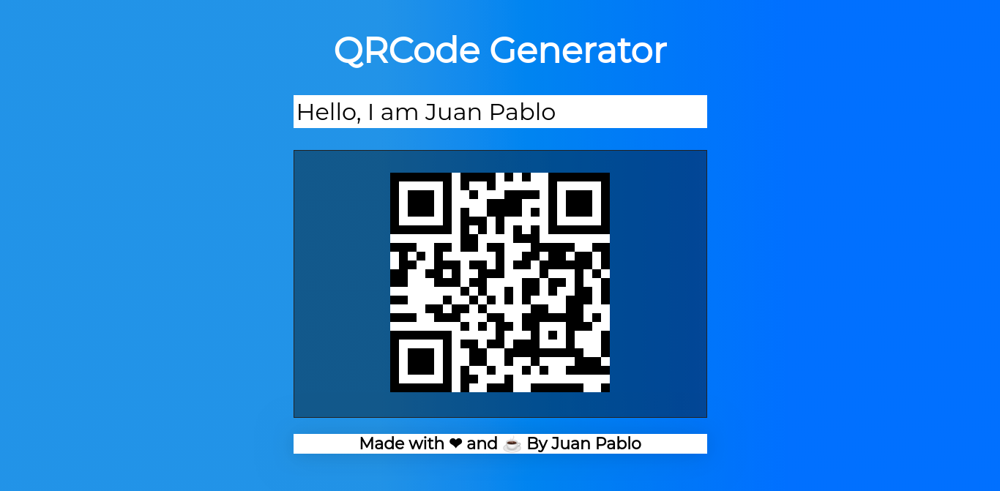

# QRCode generator

## :bookmark: About the developer

<h4 align="left">
    by <a href="https://www.linkedin.com/in/juanpablodev/" target="_blank">Juan Pablo</a>
</h4>

## :bookmark: About the project

Create <strong> QRCode </strong> easily with this VueJs application.

- Click here to access: [QRCode generator](https://juanpabllo.github.io/QRCode-generator/)

## 🚀 Technologies used

This project was developed with the following technologies:

- [Javascript](https://developer.mozilla.org/en-US/docs/Web/JavaScript)
- [VueJs](https://vuejs.org/)
- [HTML](https://developer.mozilla.org/en-US/docs/Web/HTML)
- [CSS](https://developer.mozilla.org/en-US/docs/Web/CSS)
- [QRious](https://github.com/neocotic/qrious)

## Screenshot

<h3>Point your phone at the image 😉</h3>

## :memo: License

This project is under MIT license.

<h4 align="center">
    by <a href="https://www.linkedin.com/in/juanpablodev/" target="_blank">Juan Pablo</a>
</h4>
